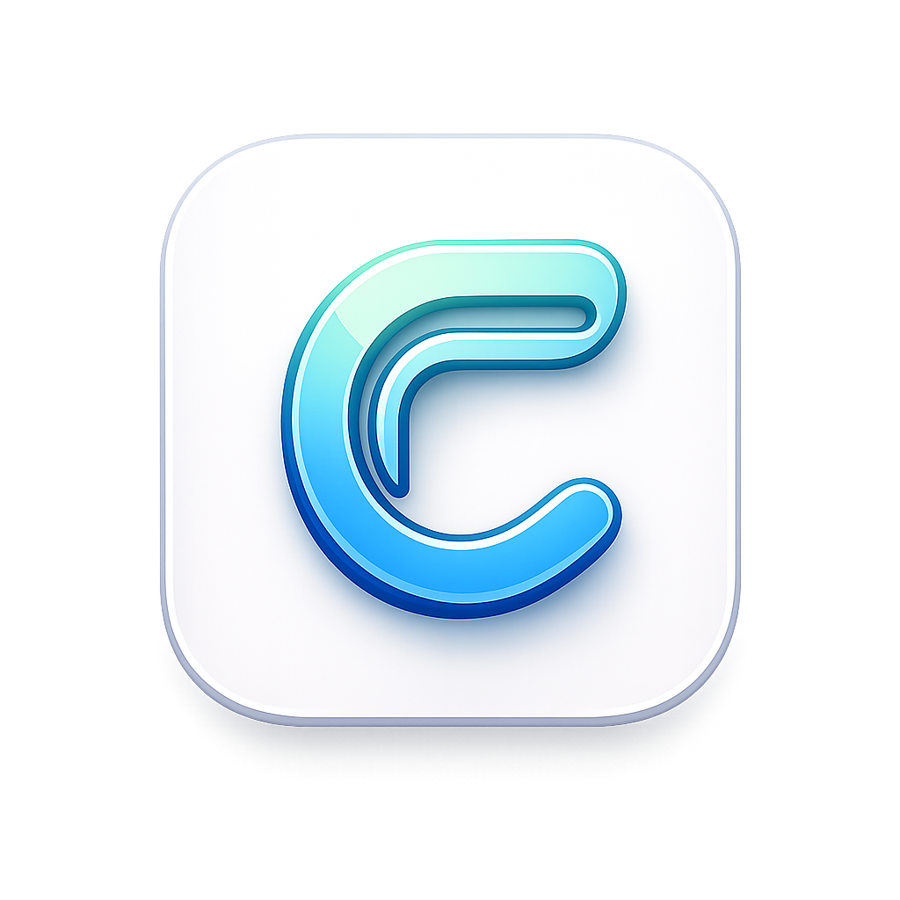

<p align="center">
  
</p>

<h1 align="center">Clipyy</h1>

<p align="center">
  A native macOS clipboard manager built with SwiftUI and SwiftData.<br/>
  Lightweight, fast, and private — everything stays on your device.
</p>

<p align="center">
  
  
  
  
  
</p>

---

## About

Clipyy is a clipboard manager for macOS that runs quietly in your menu bar. It captures everything you copy — text, images, URLs, files, and colors — and keeps a searchable, persistent history so you never lose anything from your clipboard again.

Inspired by [Paste](https://pasteapp.io/), Clipyy is built entirely with native Apple frameworks, requires no external dependencies, and stores all data locally on your machine.

---

## Features

**Clipboard Monitoring**
- Automatic capture of text, images, URLs, file references, and colors
- Intelligent content type detection with priority-based extraction
- SHA-256 deduplication — re-copying the same content moves it to the top instead of creating duplicates
- Source app tracking — see which app each item was copied from

**Floating Panel**
- Global keyboard shortcut (`Cmd + Shift + Z`) opens a floating panel from any app
- Non-activating panel design — the panel does not steal focus from your current app
- Auto-paste — selecting an item copies it and automatically pastes into the active field
- Vertical list grouped by date (Today, Yesterday, This Week, older)
- Visual previews: text snippets, image thumbnails, URL breakdowns, file icons, color swatches

**Search and Organization**
- Real-time search across your entire clipboard history
- Pin frequently used items so they are never automatically deleted
- Filter to show only pinned items

**Menu Bar Integration**
- Lives in the menu bar — no Dock icon, no window clutter
- Quick-access dropdown showing the 10 most recent items
- One-click copy from the menu bar

**Settings**
- Configurable history limit (50 to 5,000 items)
- Launch at login via `SMAppService`
- Exclude specific apps from clipboard monitoring
- Persistent storage with SwiftData and automatic external storage for images

**Privacy**
- Fully offline — no network access, no telemetry, no cloud sync
- All data stored locally in the app's SwiftData container
- Sandboxed with hardened runtime

---

## Requirements

| Requirement | Version |
|---|---|
| macOS | 26.0 or later |
| Xcode | 26.0 or later |
| Swift | 5.0 |

No third-party dependencies. The project uses only Apple frameworks: SwiftUI, SwiftData, AppKit, CryptoKit, ServiceManagement.

---

## Installation

```bash
git clone https://github.com/sshssn/clipyy.git
cd clipyy
open Clipyy.xcodeproj
```

1. Open the project in Xcode
2. Select your development team under **Signing & Capabilities**
3. Build and run (`Cmd + R`)
4. Clipyy will appear as a clipboard icon in your menu bar

### Permissions

On first launch, macOS will prompt for **Accessibility** access (required for the global keyboard shortcut). Grant access in:

**System Settings > Privacy & Security > Accessibility**

---

## Usage

| Action | How |
|---|---|
| Open floating panel | `Cmd + Shift + Z` |
| Open menu bar dropdown | Click the clipboard icon in the menu bar |
| Paste an item | Click any row — copies and auto-pastes into the active app |
| Copy as plain text | Right-click > Copy as Plain Text |
| Pin / unpin an item | Right-click > Pin |
| Search history | Type in the search bar at the top of the panel |
| Filter pinned items | Click the pin icon in the panel toolbar |
| Clear history | Click the trash icon in the panel toolbar |
| Open settings | Menu bar dropdown > Settings... |
| Close panel | `Escape` or click outside |
| Quit | Menu bar dropdown > Quit Clipyy |

---

## Architecture

```
Clipyy/
├── ClipyyApp.swift                 App entry point, MenuBarExtra scene, SwiftData container
│
├── Models/
│   ├── ClipboardItem.swift         Core SwiftData model with external image storage
│   ├── ClipboardItemType.swift     Content type enum (text, image, URL, file, color, RTF)
│   └── Pinboard.swift              Pinboard model with inverse relationship to items
│
├── Services/
│   ├── ClipboardManager.swift      NSPasteboard polling, content extraction, dedup, auto-paste
│   └── HotkeyManager.swift         System-wide Carbon hotkey for Cmd+Shift+Z
│
├── Views/
│   ├── Panel/
│   │   ├── ClipboardPanelView.swift    Main panel: search, date groups, vertical list, toolbar
│   │   ├── SearchBarView.swift         Search field with clear button
│   │   └── DateSectionHeader.swift     Date group labels
│   │
│   ├── MenuBar/
│   │   └── MenuBarView.swift       Menu bar dropdown with recent items
│   │
│   └── Settings/
│       ├── SettingsView.swift       Tab-based preferences window
│       ├── GeneralSettingsView.swift    History limit, launch at login
│       └── ExcludedAppsView.swift      App exclusion list with file picker
│
└── Utilities/
    ├── Constants.swift             App-wide configuration values
    ├── DateFormatting.swift         Date grouping and relative time formatting
    ├── PanelWindow.swift           NSPanel subclass (non-activating, floating)
    └── PanelWindowController.swift Panel lifecycle, positioning, click-outside dismiss
```

### Design Decisions

**NSPanel instead of SwiftUI Window** — The floating panel uses a custom `NSPanel` with the `.nonactivatingPanel` style mask. This is critical: without it, clicking the panel would steal focus from the user's current app, breaking the copy-paste workflow.

**Timer-based polling** — macOS does not provide push notifications for clipboard changes. Clipyy polls `NSPasteboard.general.changeCount` every 0.5 seconds, which is fast enough to feel instantaneous while using negligible CPU.

**SwiftData with external storage** — Images copied to the clipboard (screenshots, etc.) can be several megabytes each. The `@Attribute(.externalStorage)` annotation on `imageData` tells SwiftData to write large blobs to disk rather than inline in the SQLite database, preventing database bloat.

**SHA-256 deduplication** — Every clipboard item is hashed. When the same content is copied again, the existing entry's timestamp is updated rather than creating a duplicate.

**Self-copy detection** — After Clipyy writes to the pasteboard (when the user selects an item), it updates its internal `changeCount` tracker so the polling timer does not re-capture the item as a new entry.

---

## Tech Stack

| Component | Technology |
|---|---|
| UI Framework | SwiftUI |
| Persistence | SwiftData |
| Clipboard Access | AppKit (`NSPasteboard`) |
| Hashing | CryptoKit (`SHA256`) |
| Window Management | AppKit (`NSPanel`) |
| Login Item | ServiceManagement (`SMAppService`) |
| Global Hotkey | Carbon (`RegisterEventHotKey`) |

---

## License

This project is open source. See the [LICENSE](LICENSE) file for details.

---

<p align="center">
  Built with Swift and SwiftUI for macOS.
</p>
